# Release Notes

In addition to the [GitHub release notes](https://github.com/SEED-platform/seed/releases) page, this page provides more details on the changes made in each version of SEED-Platform by version number.

- [Release Notes v2.5.0](release_notes.md#version-250)
- [Release Notes v2.4.0](release_notes.md#version-240)
- [Release Notes v2.0.0](release_notes.md#version-200)
- [Release Notes v1.5.0](release_notes.md#version-150)

If you have any questions about releases or changes to the program, please contact us using one of the methods on the [contacts page](contact.md).

## Version 2.5.0

### Data Import

#### New Features

- ** Upload a GeoJSON File:** This option allows importing a file with GIS location data in the GeoJSON format

	

- ** Performance improvements: ** In general, importing files should be much faster, even for cases with many thousand records.

- ** Upload BuildingSync Data: ** Updated the import to BuildingSync Version 1.0

### Mapping and Matching

#### New Features

- ** ULID added as a matching field: ** Unique Land ID (ULID) has been added as a matching field for Tax Lot data. This is comparable to the Unique Building ID (UBID) matching field for Property data

	

## Version 2.4.0

### Data Import

#### Changes

- ** Import Portfolio Manager Data:** This option allows users to log into their ENERGY STAR Portfolio Manager account and specify the Custom Report Template from which to download data

- ** Upload BuildingSync Data:** A BuildingSync file is an XML file with building information in it, which is generated by several programs, including DOE's Asset Score. SEED can now import some variations of that XML file.

	

- ** File importing improvements:** General improvements for handling files with carriage returns, blank lines, unusual characters

- ** Performance improvements:** In general, importing files should be much faster, even for cases with many thousand records.

#### Known Issues

- ** Upload BuildingSync Data:** The program doesn't currently support all possible variations on a BuildingSync file.

### Mapping and Matching

#### New Features

- ** Column Settings (under Organizations):**  It is now possible to change the field mapping of existing data in the organization, as well "Merge Protection" which prevents specific fields (that may have been edited by hand) to be overwritten by newly imported data. For more details, see Organizations below.

- ** Column Mappings (under Organizations):** It is now possible to change the default mappings for data to be imported. For more details, see Organizations below.

#### Changes

- ** Performance Improvements:** Matching should generally be faster than in previous versions

### Inventory List View

#### Changes

- ** Performance Improvements:** Loading the inventory list has been very time-consuming, particularly with large datasets or large numbers of columns. This has been improved drastically.

### List Settings

#### Bug Fix

- ** Field order maintained on save:** In previous versions, when saving the List Settings after a change, the program would reverse the field order while still in List Settings view (although not in the actual view the settings controlled). This has been fixed in this version.

### Organizations

#### New Features

There are two new options in the Organization section of the program: Column Settings and Column Mappings

- ** Column Settings:** This is a new screen which allows users 1) change the display name of a column that already exists in the database, and 2) specify what fields should be protected from having new data replace existing data.

	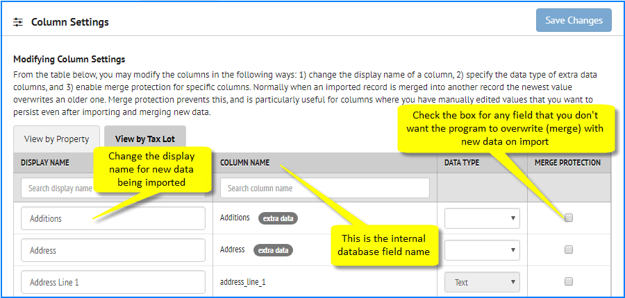

- ** Column Mappings:** This screen shows the stored default mappings for files that have been previously imported, which is the default mapping for these fields when new files are imported in the future.  If problems are found in the mappings here, the bad mappings should be deleted so that when new files with these fields are imported, those same mapping mistakes will not be made again. Changing the mappings here does not affect existing data, it only affects the default mapping settings for data that will be imported in the future.

	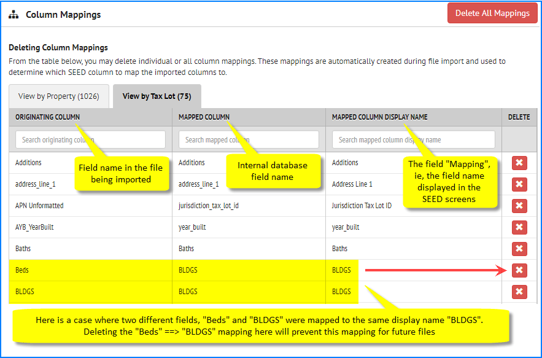

## Version 2.0.0

### Data Model

#### Changes

- The data is now stored in two table structures, one for Tax Lot/Parcel information, one for Property/Building Information

- Each record in those tables is associated with a time period called a Cycle, which can correspond to a benchmarking compliance cycle.

### Navigation Bar

#### Changes

- ** Projects: ** disabled for the current release because we want to work with users to make sure we have a feature that solves user needs, which the previous iteration of Projects may not have. 

- ** Inventory: ** BUILDINGS is now INVENTORY, because the program is now storing and displaying data from the perspective of Tax Lot/Parcel and Property/Building.

- ** API Documentation:** added an implementation of the Swagger API framework to display the program API structure for developers.

- **Log Out: ** moved Log Out to the last option of the Navigation bar from an option in the user account, which makes it more straightforward to log out of the program

	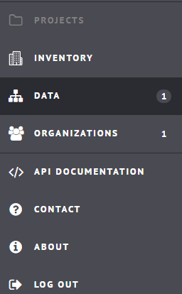

### Data Import

#### Changes

- ** Specify Time Period/Cycle: ** Each time a file is imported, it must be associated with a Time Period/Cycle. 

	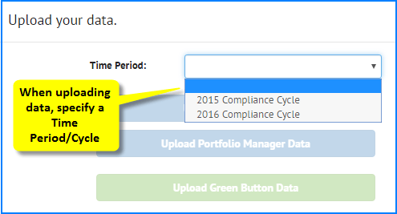

#### Known Issues

- ** Green Button Data: ** Green Button Data upload is disabled. This feature is being reworked.

### Mapping

#### Changes

- ** Assign fields to Property / Tax Lot: ** The new data model requires that during field mapping, each field be assigned to either the Property or the Tax Lot table.	

	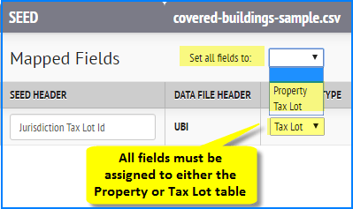

- ** Matching field names: ** The Matching field name **Tax Lot ID** is now called **Jurisdiction Tax Lot ID**. The other Matching field names remain the same (**Custom ID 1**, **PM Property ID** and **Address Line 1**)

#### Known Issues

 - ** Display of mapping list is very slow when there are many fields ([1215](https://github.com/SEED-platform/seed/issues/1215)):** In some cases, such as a Portfolio Manager file with 250 fields, the program can take over a minute to display values from the pulldown list in the Mapping field, or to let you type in a field.

### Mapping Review Screen

#### Changes

- ** Tabs for each table:** There are now tabs for the Property and Tax Lot fields and records, depending on how the data is mapped. 

- ** All the data is loaded:** it is possible to scroll through all the records in the import file being reviewed

	

#### Known Issues

- ** Mapped field names sometimes not shown properly:** In some cases, the actual “field name” may be displayed in the column header, such as in the case below property_type, rather than the “display name” which in this case should be Property Type. However, if there is data in the field, then the program has been able to put the data into the table.
	
	

- ** Property Tab when only Tax Lot data is mapped:** If Jurisdiction Tax Lot ID is mapped, there will be a View by Property tab showing just that field, when no fields were mapped to the Property table.  This is currently there by design but can be confusing. 

	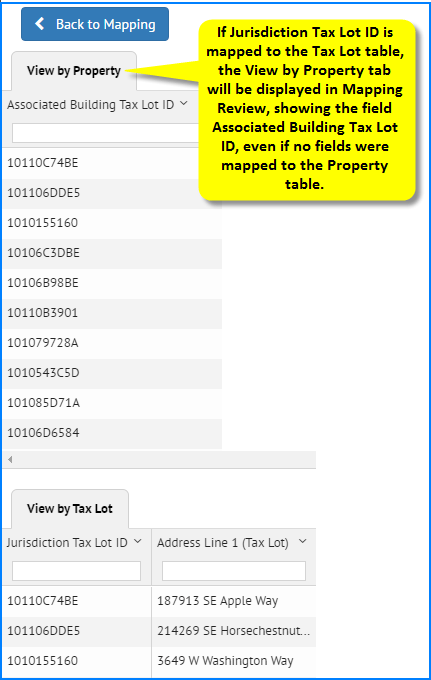

### Matching

#### Changes

- ** Changes for New Data Model:** Matching has changed due to the new data model. Based on how field are mapped to “matching” fields, the program first does a “merge” on records and data in the same table, and then “pairs” records between the Property and Tax Lot tables.

#### Known Issues

- ** Program Hangs on 100% Complete ([1217](https://github.com/SEED-platform/seed/issues/1217)):** When the matching has finished, the 100% Complete dialog box remains, so it is necessary to click the Cancel button to remove it and then click on the Inventory Navigation bar to see the imported/matched records

	

- ** Matching status dialog box does not reflect correct state of data ([1221](https://github.com/SEED-platform/seed/issues/1221)):** under some circumstances, when the program finishes matching, it presents a dialog box about the status of the matching. In this version, the information on that dialog is likely to be incorrect. 

	

- ** Program creates Property record even when only Tax Lot fields are mapped ([1219](https://github.com/SEED-platform/seed/issues/1219)):** under some circumstances when only matching a file to the Tax Lot table (for example if the Property tab was displayed in the Matching Review screen), the program will make an extraneous Property record that can be seen in the View by Property tab after the data has been matched.

	Sometimes this Property record is paired to a Tax Lot record, in which case if it is deleted, the Tax Lot record is also deleted

	If it is not paired to a Tax Lot record (ie, there is no “+” to the left of the record, or no value displaying in the Associated Building Tax Lot ID or Jurisdiction Tax Lot ID fields, the record can be safely deleted. 

	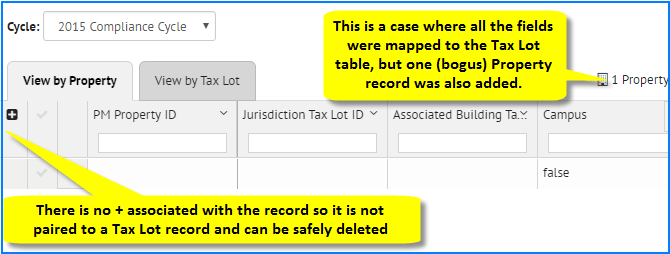

	Click on the Checkmark column to the left of the record to select the record and then Delete Selected from the Actions pulldown list.

	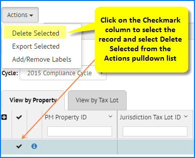

	When you delete the record, the program will indicate whether it is going to delete **1 property record**, or **1 property record AND 1 tax lot record** (in which case you should not proceed with the delete) 

	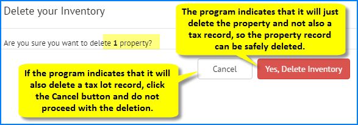

- ** Hand Matching is not enabled:** The ability to match and unmatch records “by hand”, i.e., override the automated matching done by the program (which existed in version 1.5), is not enabled in this version of the program.

### Inventory List View

#### Changes

- Rework of Buildings (now Inventory) screen: Due to the new data model, there have been significant changes to the main screen where imported data is viewed.
See the V 2.0 Users Guide for a complete description of the new Inventory List and Detail views.

	- **Tabs:** There are two tabs, View by Property and View by Tax Lot
	- **Cycle:** Each data view is associated with a Cycle
	- **Page Title:** Title of page is now either Properties or Tax Lots, depending on which tab is selected, and no longer contains the number of records
	- **Number of records:**  the number of records is moved from the page title to the right hand side of the tab, because each tab can have different records
	- **Links at the top of the page:**
		- Buildings link (in V 1.5) is now called either Tax Lots List or Properties List, depending on which tab (Property or Tax Lot) is selected
		- **Labels:** admin link moved to Organizations
	- **All records displayed at once:** the program no longer loads just 10 - 100 records at a time. When a tab is selected, the program loads the grid with all the appropriate records
	- **Actions pulldown:** the name for the pulldown list that was called **Building Actions** is now **Actions**
	- **Filter by label:** Clicking inside this field only shows the labels that are assigned to records currently being viewed (rather than showing a list of all possible labels), based on the Cycle and Tab selected
	- **Filter Input box:** The value(s) entered into the filter boxes are applied immediately upon typing them; there no longer a need to press the **Enter** key to activate them, or click on an **Update Filters** button (in V 1.5)
	- **Sorting:** Sorting can be accomplished two different ways: 1) click the column header and it will do a simple ascending, descending or original sort; 2) click the arrow on the upper right of the column and it is possible to do hierarchical sorting (see the User Guidelines for more details)
	- **Show all, Matched and Unmatched pulldown:** This pulldown (in V 1.5) has been removed. The “+” column indicates whether there are records matched between the Property and Tax Lot tables
	- **Info button to access Detail view:** To see the detail view of a record, click on the “info” icon on the left side of the tab grid.

	

#### Known Issues

- **Actions pulldown:** the Actions pulldown does not contain options for creating and adding to existing Projects, as Projects have not been implemented in this version.

- **Sorting alphanumeric fields does not work properly in all cases ([1218](https://github.com/SEED-platform/seed/issues/1218)):** There are some fields (generally defined as numeric) that the program is not sorting properly when the data is alphanumeric. One example is a Zip Code field that would generally have 5 digits, but in some cases may have 9 digits with a hyphen separating the 5 digit and 4 digit sections.

- **Some mapped data is not displaying in detail and list view ([1213](https://github.com/SEED-platform/seed/issues/1213)):** Under some circumstances, not all the mapped fields are displayed in the List or Detailed view, and are not available to select in the List Settings for either view. It is therefore important to check in both the Mapping Review screen and the final records in the Inventory lists (Property and Tax Lot) to make sure that all the fields in the original file are displayed. If they are not, it may be necessary to reimport the data and change either the mapping or the field names in the original file. 

- **Slow display of records for large data sets ([1105](https://github.com/SEED-platform/seed/issues/1105)):** For organizations that have more than a few thousand records in either the Tax Lot or Property tables, the display of the records can take several seconds, because the program is loading all the records into the view. However, once the records are loaded, the actions in the view (filtering, sorting, etc) will be very responsive.

- **Deleting Records ([1214](https://github.com/SEED-platform/seed/issues/1214)):** Deleting records (from the Actions pulldown list) will delete associated Tax Lot and Property records. If this is not desired, it might be necessary to label the record in question for deletion but not actually delete it in this version of the program. Future versions may include the option to delete the record in question without deleting it’s paired record, and should include the feature to allow un-pairing of records (unmatching “by hand”), which would then allow deletion of the records without deleting the previously paired record. 

- **Hide Column doesn’t persist ([1220](https://github.com/SEED-platform/seed/issues/1220)):** The Hide Column feature doesn’t persist the state of hidden columns when moving off the current view. When coming back to that view, the hidden column will no longer be hidden. The work around is to define which columns should be visible in the List view through the List Settings feature. 

	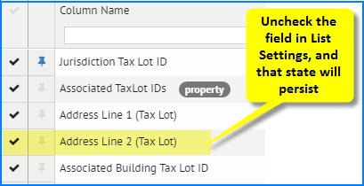

### Inventory Detail View

#### Changes

- **Default Detail view will not show all fields:** The first time the Tax Lot or Property Detail view is accessed, not all the fields will be displayed. However, using the List Settings allows all the mapped fields to be selected for display (with the exceptions noted in [1213](https://github.com/SEED-platform/seed/issues/1213)).

#### Known Issues

- **Import history not displayed ([1139](https://github.com/SEED-platform/seed/issues/1139)) (but edit history is displayed):** The import history for a given record is not being captured or displayed in the Detail view (this history was captured and displayed in V 1.5). However, when a record is edited in the Detail view, the program does keep the history. 

	

### List Settings

#### Changes

- **Field Display status and order:** In List Settings, the functions of selecting which fields to display and setting their order happens in the same screen and does not need to be saved. The last state of the fields is saved automatically. 

- **Separate List Settings for Tax Lot and Property Detail view:** The program allows a different List Settings “state” for Tax Lot and Property Detail views. 

#### Known Issues

- **Property and Tax Lot indicators are not always correct ([1170](https://github.com/SEED-platform/seed/issues/1170)):** In List Settings, the program attempts to indicate whether a field belongs to the Tax Lot or Property table. However, in come circumstances, those indicators are not correct. But these indicators are strictly informational and don’t affect the display of the data if the fields are selected

	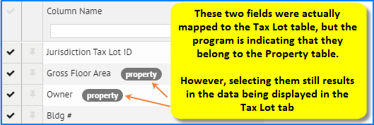

- **Multiple fields with the same name ([1171](https://github.com/SEED-platform/seed/issues/1171)):** In List Settings, there may be multiple instances of the same field name, possibly with the wrong marker for which table it belongs to, with no indication which will contain data. 

	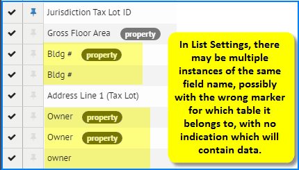

	Generally, the first one in the list will be the one that will display data. However, if that isn’t the case, the work around for this situation is to select all of the fields, go back to the list view, determine which one shows data, and from the list view, use the Hide Column option (accessed from the down arrow in the upper right of the field column) to hide the fields that do not have data.

	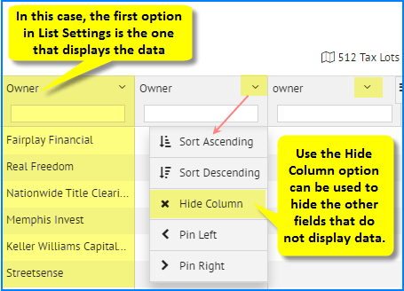

### Labels

#### Changes

- Label Admin is under Organizations: The Label admin screen used to be in the Building list (which is now either Tax Lot or Property) but has been moved in this version to the Organizations view

### Organizations

#### Changes

- **Cycles Admin link added:** Cycles are defined in Organizations

- **Labels Admin link moved:** The Labels admin link is moved from the old Building list to Organizations

	

#### Known Issues

- **Cycles:** There is currently not an option to delete existing cycles

### API Documentation

#### Changes

- API Documentation in navigation bar: This version has a new option in the main Navigation bar called API DOCUMENTATION, which will display a Swagger API platform which shows how each API is used in the program as well as having the option to test API functionality

	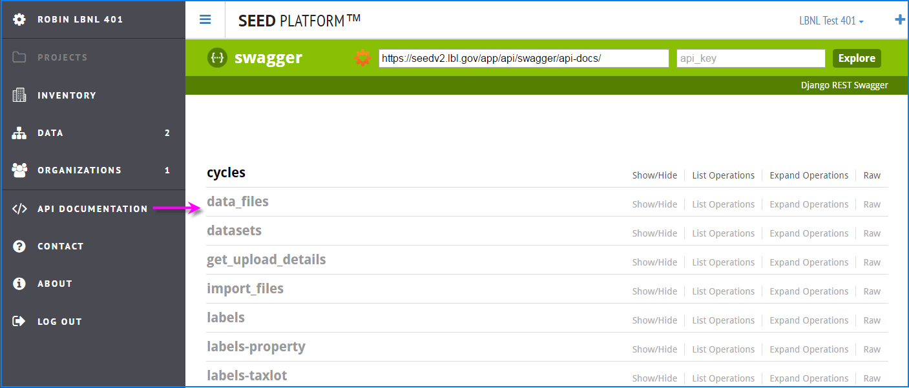

### Administration (Superuser)

#### Changes

- **Admin screen:** The list of organizations under the admin screen now shows the Parent ID if there are suborganizations, as well as the internal database organization ID, the date the organization was created, and the Property and Tax Lot record count by Cycle. 

#### Known Issues

- ** User account without an organization ([1024](https://github.com/SEED-platform/seed/issues/1024)):** The program will allow a superuser to create a user account without an organization, so make sure that all the fields are properly defined, including the organization, when creating new users.

#### Bug Fixes

- **Performance enhancements:** It is much faster to view the organizations in the program, as well as to delete records from organizations.

## Version 1.5.0

### Labels

#### Bug Fixes

- When adding labels from the Building List, the program generates the list of labels even with large data sets, including selecting records from multiple pages.

- When you click on the Building Detail view, the program keeps the "filter by label" status at the Building List level. 

### Data Import

#### Bug Fixes

- Program now handles many unusual characters in Excel files, such as bullets, new lines, etc.

- There have been improvements when importing large files with thousands of records.

### Building List

#### Bug Fixes

- Program stays on the Building List page where you started when returning from Building Detail. If you are on page 10 in the Building List and go to the Building Detail view for one of the records on that page, when you come back to the Building List, you are still on page 10. The program used to put you back on page 1.

- A single quote (such as apostrophe) no longer causes the building search function to crash

- Filtering on the date fields should now work for Mozilla Firefox and Microsoft Internet Explorer. For those two browsers, the date format needs to be "2014-12-31".

### Building Detail

#### Bug Fixes

- The field order is no alphabetical by default

#### Enhancements

- The program now allows resizing of the columns.

- Clicking on a field shows the entire contents of the field in a call out.

### Mapping

#### Bug Fixes

- The program shows all the mapped fields in the Mapping screen, including those in the extra_data JSON blob field.

### Projects

#### Bug Fixes

- Exporting records from Projects has been fixed

### Behind the Scenes

#### Bug Fixes

- Many code cleanup changes have been made which allows for more efficient development

