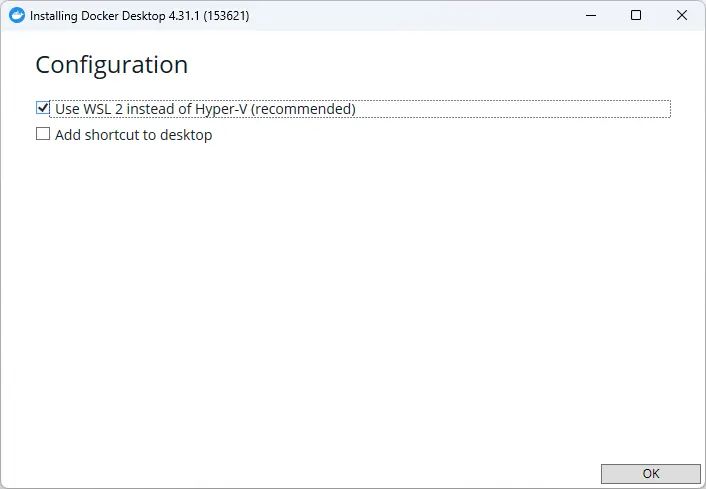
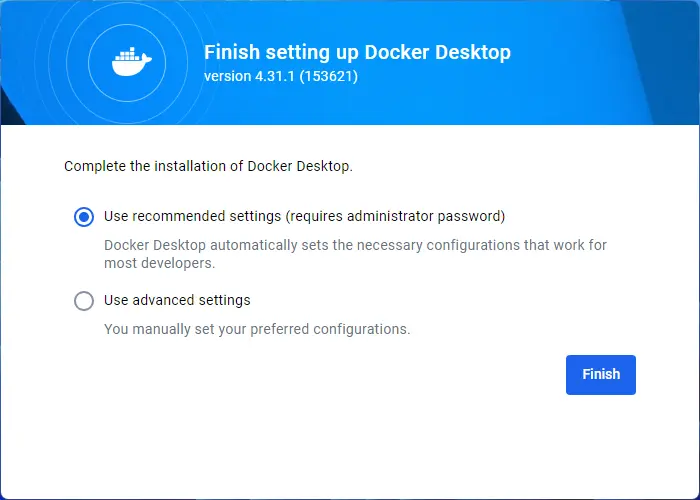
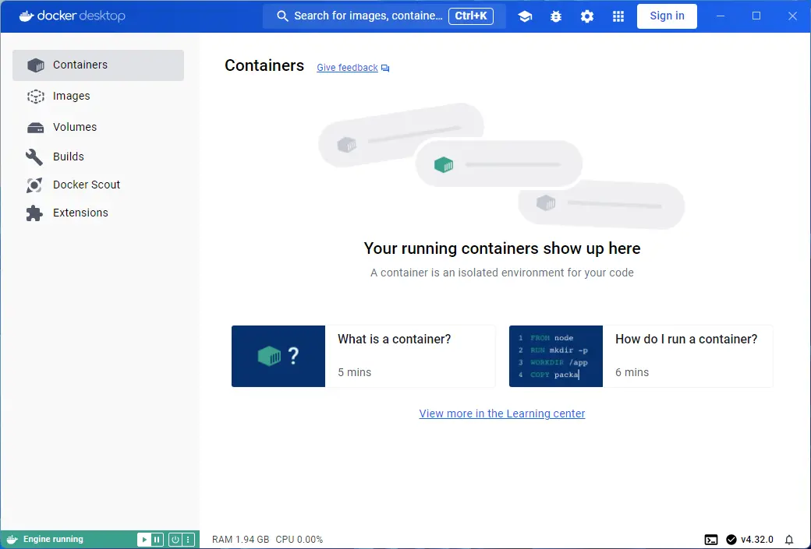
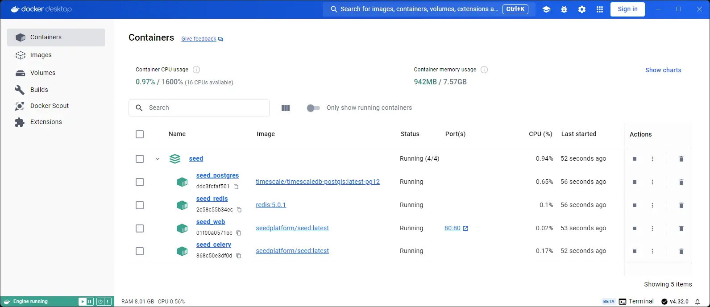

# Self-Hosting

The SEED Platform™ is a server-based web application designed for end-user access through a web browser. SEED Platform was developed using the Django Python web framework and requires a relational database and several other services (listed below). The only database currently supported is PostgreSQL. SEED Platform is not a desktop-based application that can be installed by the end-user; see the [SEED Technical Allies](technical_ally.md) and [Requesting Test Instance](test_instance_request.md) pages for information about options to access SEED Platform as an end-user.

If you are interested in hosting the SEED Platform yourself on your own servers, you can review the documentation below to get started. 

??? note "Amazon Web Services"

	Amazon Web Services (AWS) provides the preferred hosting for the SEED Platform and is currently the only cloud provider for which SEED has been configured and tested.
	For more information see our [AWS Setup Guide](https://github.com/SEED-platform/seed/blob/develop/docs/source/aws.rst)

??? note "Windows"

	1. Install Docker Desktop, and opt for WSL 2 if possible (~5 minutes)
		{:.seed-img}

	2. Use the recommended settings
		{:.seed-img}

	3. If successful, you'll see Engine running in the bottom left corner of the window
		{:.seed-img}

	4. Create a directory to store the configuration files (going forward I'm assuming it's "C:\SEED") and add the two attached files.
		a. Review the variables inside .env and modify as needed (especially related to AWS for sending emails).
		b. The docker-compose.yml file is a slightly modified version of the [file from the repo](https://github.com/SEED-platform/seed/blob/develop/docker-compose.yml).

	5. Create shared volumes for the database and files using the following commands:
			docker volume create seed_pgdata
			docker volume create seed_media

	6. With a command prompt inside the C:\SEED directory run docker compose up -d. This will automatically pull the container images and start the entire stack (~6 minutes to download and start the containers, ~11 minutes to initialize the database after the command succeeds)

	7. At this point you should see the containers running within Docker Desktop
		{:.seed-img}

	8. Once the database is done initializing, you can browse to `http://localhost/` to access SEED (If you see a 502 Bad Gateway message, then the initialization step is still running).

		a. You should be able to login with the user/password credentials from the .env file - once logged in, then you can create more users (assuming the email configuration is working as expected)
		{:.seed-img}

	9. Advanced - if you want, you can modify the configuration to mount a shared directory between the host and the Docker containers (e.g. a Share directory where database backups can be exported/restored)