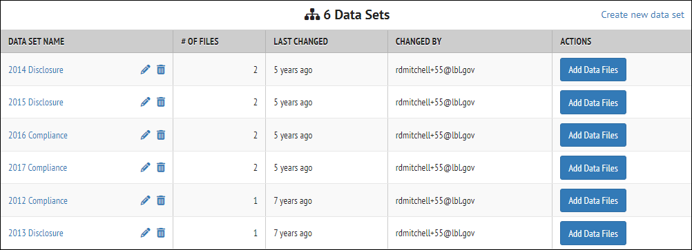
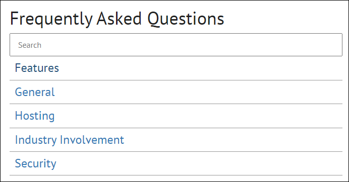
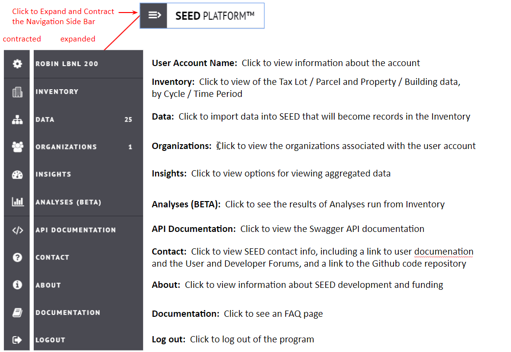
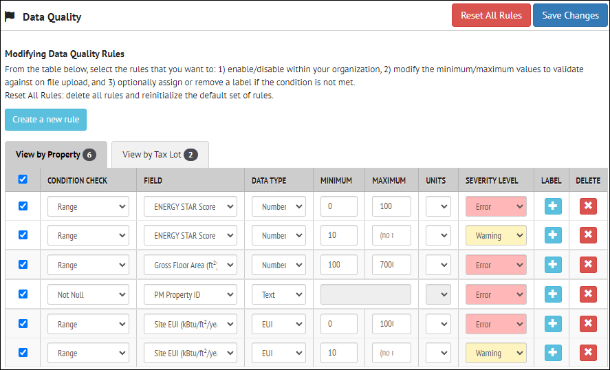
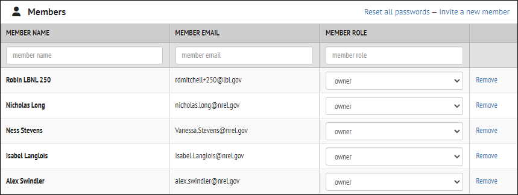
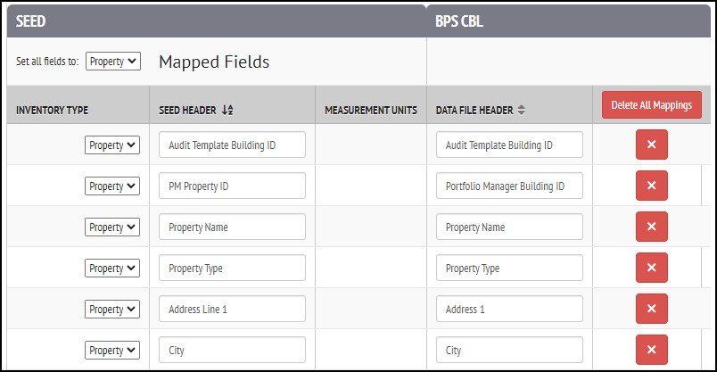
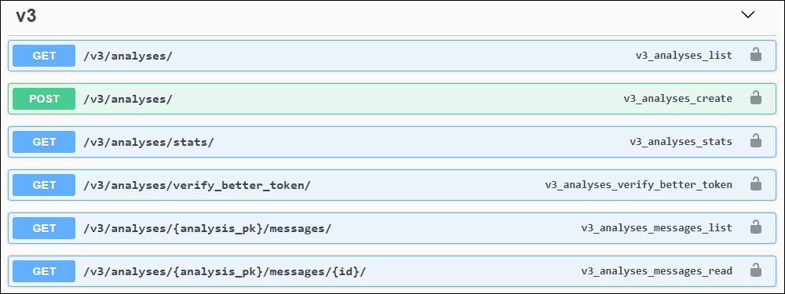
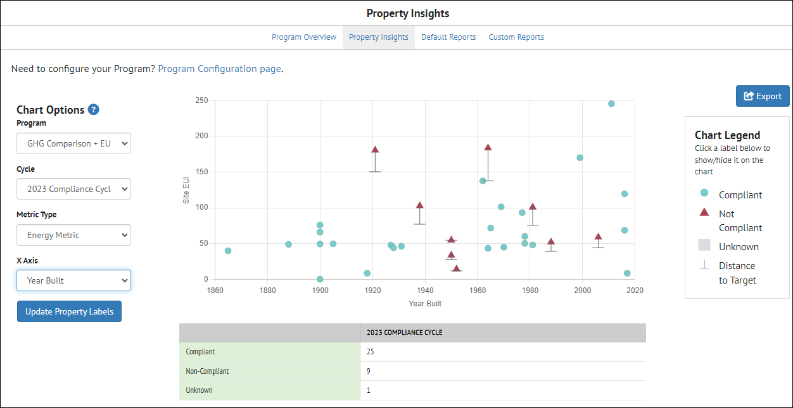

# **Data Import**

SEED is primarily a data management platform, and importing the data is a critical component to understand. 

## **Overview**

SEED can import data from many different sources, for example:

### Building / Property Data

Building and property lists can sometimes be difficult to create. There are a few different sources of data that may help, which can be imported into SEED in the form of spreadsheets with one line per building, such as: 

    * Tax assessor lists
    * Real estate data 

### Benchmarking data

One of the primary sources of building information for benchmarking and Building Performance Standards (BPS) ordinances  is data entered by building owners into ENERGY STAR Portfolio Manager which is then shared with jurisdictions who are determining compliance with the ordinances.

SEED can import data from spreadsheets downloaded from ENERGY STAR Portfolio Manager and then imported into SEED. It is also possible to log into an ENERGY STAR Portfolio Manager account directly from SEED and specify a report to be imported. 

### Match data from different sources

One of the strengths of SEED is that data for a specific building or property can be imported from multiple sources and then matched and merged within SEED so that all the information related to that building is collected in one platform. 

In order for the data from different sources to be merged together, there must be one or more “matching” fields that are in all the data. These fields are identified during the data import “Mapping” step, which will be discussed in the next section. These matching fields typically include: 

* Tax Assessor Parcel ID
* Custom Building ID
* ENERGY STAR Portfolio Manager ID 

### Handle data with different types of relationships

In addition to matching and merging data for the same building or property, SEED can establish a relationship between a Tax Assessor Parcel and the buildings or properties associated with that parcel. Establishing this relationship is optional, but if Tax Assessor Parcel data is used to begin the creation of a building or property list, or the parcel / building relationship is desired, SEED can accomplish this during the mapping process, as long as there is both a tax parcel ID and a building or property ID in the data being imported. 

The image below shows the possibilities of tax parcel and building relationships:

* Case A: a one to one relationship, ie, one building on one parcel
* Case B: Multiple buildings on one parcel
* Case C: One building on multiple parcels
* Case D: Multiple buildings on multiple parcels, such as a campus scenario

>>>>>  gd2md-html alert: inline image link here (to images/image1.png). Store image on your image server and adjust path/filename/extension if necessary.  (<a href="#">Back to top</a>)(<a href="#gdcalert2">Next alert</a>) >>>>> 

The SEED data model establishes the relationship between the tax parcels and buildings as shown in the simplified diagram below. In the main Inventory list view, there are two tabs, one for Property and one for Tax Lot.

>>>>>  gd2md-html alert: inline image link here (to images/image2.png). Store image on your image server and adjust path/filename/extension if necessary.  (<a href="#">Back to top</a>)(<a href="#gdcalert3">Next alert</a>) >>>>> 

### Maintain data based on compliance year 

Data is imported into SEED by “cycles”, which are generally defined on a calendar basis, to keep track of the annual compliance of buildings. There are several features in SEED which allow importing, viewing, and analyzing the status of buildings across cycles. 

## Data import workflow

The first three steps in the diagram below shows the workflow when importing data into SEED

>>>>>  gd2md-html alert: inline image link here (to images/image3.png). Store image on your image server and adjust path/filename/extension if necessary.  (<a href="#">Back to top</a>)(<a href="#gdcalert4">Next alert</a>) >>>>> 

## **Before importing data**

There are a few steps that should be completed before importing data, in order to have a smooth process.

### Define Cycles in Organizations / Cycles

It is important to create the appropriate cycle to import the data into. SEED has one “default” cycle that can be used as is, or edited to suit the first data import. It is also possible to make as many cycles as needed to import the data. 

>>>>>  gd2md-html alert: inline image link here (to images/image4.png). Store image on your image server and adjust path/filename/extension if necessary.  (<a href="#">Back to top</a>)(<a href="#gdcalert5">Next alert</a>) >>>>> 

>>>>>  gd2md-html alert: inline image link here (to images/image5.png). Store image on your image server and adjust path/filename/extension if necessary.  (<a href="#">Back to top</a>)(<a href="#gdcalert6">Next alert</a>) >>>>> 

#### **Data files with multiple years of data**

If a file is to be imported with multiple cycles (years) of data in it, the appropriate cycles need to be defined before importing the data. For example, if there is data from 2019, 2020 and 2021 in one file, and that data is to be associated with the cycle for each year, a cycle for each of those years need to be defined. SEED uses a field called “Year Ending”. This is a default field that is in ENERGY STAR Portfolio Manager data, but could be added to other data if needed.

>>>>>  gd2md-html alert: inline image link here (to images/image6.png). Store image on your image server and adjust path/filename/extension if necessary.  (<a href="#">Back to top</a>)(<a href="#gdcalert7">Next alert</a>) >>>>> 

Make sure that a cycle is defined for each year of data in the data file.

>>>>>  gd2md-html alert: inline image link here (to images/image7.png). Store image on your image server and adjust path/filename/extension if necessary.  (<a href="#">Back to top</a>)(<a href="#gdcalert8">Next alert</a>) >>>>> 

### Define Matching fields in Organizations / Column Settings

In order to map the fields properly when importing data, it is important to define the fields that will be the “matching” fields across data files. 

The matching fields are defined in Organizations / Column Settings. There is a column called “MATCH CRITERIA”, and the fields that are matching fields should be checked. There can be just one field defined, or multiple fields. Standard fields for matching are the PM Property ID field from ENERGY STAR Portfolio Manager, and/or the Custom ID 1 field, which can represent any unique building ID. 

The Column Description field can be edited to represent a more descriptive name. For example, if the matching field is Custom ID 1, that Column Description could be changed to “City X Building ID”.

>>>>>  gd2md-html alert: inline image link here (to images/image8.png). Store image on your image server and adjust path/filename/extension if necessary.  (<a href="#">Back to top</a>)(<a href="#gdcalert9">Next alert</a>) >>>>> 

Once the cycles are properly defined and the matching fields are set, it is time to import the data

## **Importing data**

There are a few different ways to start importing data. You can click the DATA navigation button on the left side of the screen, or you can click on the “Upload your Buildings List” button on the main SEED Platform screen.

>>>>>  gd2md-html alert: inline image link here (to images/image9.png). Store image on your image server and adjust path/filename/extension if necessary.  (<a href="#">Back to top</a>)(<a href="#gdcalert10">Next alert</a>) >>>>> 

### Create a data set

The DATA navigation button on the left side of the application will display the screen shown below, where a new data set can be created. The Data Set Name can be any text that describes the data set that is being created. There will potentially be multiple files imported in a data set. 

>>>>>  gd2md-html alert: inline image link here (to images/image10.png). Store image on your image server and adjust path/filename/extension if necessary.  (<a href="#">Back to top</a>)(<a href="#gdcalert11">Next alert</a>) >>>>> 

Clicking the “Create Data Set” button will open the screen shown below, which has several options for what type of data to upload, as well as how to upload it. 

The first step is to assign this data upload to a cycle -- the pull down list will show all the cycles that are defined. It is also possible to define a new cycle by clicking the “Manage available cycles” link under the Cycle pulldown. And if the file being imported has multiple years defined (based on a field called “Year Ending”) the “Multiple Cycle Upload” box can be checked. 

>>>>>  gd2md-html alert: inline image link here (to images/image11.png). Store image on your image server and adjust path/filename/extension if necessary.  (<a href="#">Back to top</a>)(<a href="#gdcalert12">Next alert</a>) >>>>> 

### Upload a Spreadsheet

The first option in the list of upload options is “Upload a Spreadsheet”. 

This option assumes that the spreadsheet will have one record per property or tax parcel. This spreadsheet can contain both property / building and tax parcel information, or it can be just one or the other. 

Here is an example of a spreadsheet representing a list of tax parcels that have buildings on them. Each row represents a tax parcel.

>>>>>  gd2md-html alert: inline image link here (to images/image12.png). Store image on your image server and adjust path/filename/extension if necessary.  (<a href="#">Back to top</a>)(<a href="#gdcalert13">Next alert</a>) >>>>> 

Here is an example spreadsheet of building information from ENERGY STAR Portfolio Manager for the same buildings. In this case, each row represents an individual building, and each row has the tax parcel ID associated with the building. 

>>>>>  gd2md-html alert: inline image link here (to images/image13.png). Store image on your image server and adjust path/filename/extension if necessary.  (<a href="#">Back to top</a>)(<a href="#gdcalert14">Next alert</a>) >>>>> 

When these two spreadsheets are imported into SEED, the relationship between the tax lots and buildings can be established in the mapping step

#### **Upload a tax parcel spreadsheet**

First, import the tax parcel spreadsheet into the data set by clicking the Upload a Spreadsheet button, navigating to the file to be imported, and as the file is imported, messages will appear to show the progress of the upload.

>>>>>  gd2md-html alert: inline image link here (to images/image14.png). Store image on your image server and adjust path/filename/extension if necessary.  (<a href="#">Back to top</a>)(<a href="#gdcalert15">Next alert</a>) >>>>> 

This message appears when the file has completed the first upload step. Click the “Continue to data mapping” button to move to the next step.

>>>>>  gd2md-html alert: inline image link here (to images/image15.png). Store image on your image server and adjust path/filename/extension if necessary.  (<a href="#">Back to top</a>)(<a href="#gdcalert16">Next alert</a>) >>>>> 

### Mapping the data

The Mapping screen will now appear, and the fields in the uploaded file need to be mapped to the appropriate SEED fields. 

If this is the first file being imported, the easiest way to start the mapping is to click the “Copy Data File Headers directly to SEED headers” which copies the fields from the right hand side (the fields in the uploaded file) to the SEED Mapped Fields on the left side. 

>>>>>  gd2md-html alert: inline image link here (to images/image16.png). Store image on your image server and adjust path/filename/extension if necessary.  (<a href="#">Back to top</a>)(<a href="#gdcalert17">Next alert</a>) >>>>> 

Change the field called “Parcel Number” to the matching field “Jurisdiction Tax Lot ID”.

>>>>>  gd2md-html alert: inline image link here (to images/image17.png). Store image on your image server and adjust path/filename/extension if necessary.  (<a href="#">Back to top</a>)(<a href="#gdcalert18">Next alert</a>) >>>>> 

Save the final mapping to a “Column Mapping Profile name, to save the mappings for another file of the same structure. 

>>>>>  gd2md-html alert: inline image link here (to images/image18.png). Store image on your image server and adjust path/filename/extension if necessary.  (<a href="#">Back to top</a>)(<a href="#gdcalert19">Next alert</a>) >>>>> 

This creates a Column Mapping profile that can be used again for another file with the same fields. 

>>>>>  gd2md-html alert: inline image link here (to images/image19.png). Store image on your image server and adjust path/filename/extension if necessary.  (<a href="#">Back to top</a>)(<a href="#gdcalert20">Next alert</a>) >>>>> 

Then click the Map Your Data button to go to the Mapping Review screen.

>>>>>  gd2md-html alert: inline image link here (to images/image20.png). Store image on your image server and adjust path/filename/extension if necessary.  (<a href="#">Back to top</a>)(<a href="#gdcalert21">Next alert</a>) >>>>> 

### Review the mapped data

In the Mapping Review screen all the records will be displayed, with the new field mapping. If there is anything that needs to be changed, click the Back to Mapping button and the mapping can be changed as needed.

>>>>>  gd2md-html alert: inline image link here (to images/image21.png). Store image on your image server and adjust path/filename/extension if necessary.  (<a href="#">Back to top</a>)(<a href="#gdcalert22">Next alert</a>) >>>>> 

Click the Save Mappings button to complete the data upload process; a confirmation screen will be displayed. Click the Confirm mappings

>>>>>  gd2md-html alert: inline image link here (to images/image22.png). Store image on your image server and adjust path/filename/extension if necessary.  (<a href="#">Back to top</a>)(<a href="#gdcalert23">Next alert</a>) >>>>> 

A progress bar will be displayed

>>>>>  gd2md-html alert: inline image link here (to images/image23.png). Store image on your image server and adjust path/filename/extension if necessary.  (<a href="#">Back to top</a>)(<a href="#gdcalert24">Next alert</a>) >>>>> 

When the matching is complete, a summary of what was imported will be displayed. 

>>>>>  gd2md-html alert: inline image link here (to images/image24.png). Store image on your image server and adjust path/filename/extension if necessary.  (<a href="#">Back to top</a>)(<a href="#gdcalert25">Next alert</a>) >>>>> 

Click the View my Properties to go to the Inventory list to see the uploaded data. 

#### **Upload an ENERGY STAR Portfolio Manager spreadsheet**

After uploading the tax lot spreadsheet, the next step might be to load the ENERGY STAR Portfolio Manager spreadsheet for the buildings associated with the tax lots already imported. 

The same steps are followed:

* In the same Data Set, click the Add more data files link

    

>>>>>  gd2md-html alert: inline image link here (to images/image25.png). Store image on your image server and adjust path/filename/extension if necessary.  (<a href="#">Back to top</a>)(<a href="#gdcalert26">Next alert</a>) >>>>> 

* Make sure the same cycle is selected, then click the Upload a Spreadsheet button.

    

>>>>>  gd2md-html alert: inline image link here (to images/image26.png). Store image on your image server and adjust path/filename/extension if necessary.  (<a href="#">Back to top</a>)(<a href="#gdcalert27">Next alert</a>) >>>>> 

* Browse to the appropriate file
* In the Mapping screen
    * Copy the Data File headers to the SEED headers
    * Set the INVENTORY TYPE to Property for all fields except “Parcel ID”
    * Set the INVENTORY TYPE to Tax Lot for the “Parcel ID” field, and change the SEED Header mapping to the Tax Lot matching field “Jurisdiction Tax Lot ID”. This will establish the relationship between the PM Property ID Matching field and the Jurisdiction Tax Lot field for each record
    * Save the final mapping to a new Column Mapping Profile
    * Click Map Your data to go to the Mapping Review screen

    

>>>>>  gd2md-html alert: inline image link here (to images/image27.png). Store image on your image server and adjust path/filename/extension if necessary.  (<a href="#">Back to top</a>)(<a href="#gdcalert28">Next alert</a>) >>>>> 

* The Mapping Review screen will show the records mapped to the Properties table and the records mapped to the Tax Lot table

    

>>>>>  gd2md-html alert: inline image link here (to images/image28.png). Store image on your image server and adjust path/filename/extension if necessary.  (<a href="#">Back to top</a>)(<a href="#gdcalert29">Next alert</a>) >>>>> 

* Click Save Mappings to finish the record mapping and matching process
    * The progress bar will be displayed

        

>>>>>  gd2md-html alert: inline image link here (to images/image29.png). Store image on your image server and adjust path/filename/extension if necessary.  (<a href="#">Back to top</a>)(<a href="#gdcalert30">Next alert</a>) >>>>> 

    * The results of the matching and merging will be displayed

        

>>>>>  gd2md-html alert: inline image link here (to images/image30.png). Store image on your image server and adjust path/filename/extension if necessary.  (<a href="#">Back to top</a>)(<a href="#gdcalert31">Next alert</a>) >>>>> 

* Click the View my properties button to view the imported data in the Inventory List

    

>>>>>  gd2md-html alert: inline image link here (to images/image31.png). Store image on your image server and adjust path/filename/extension if necessary.  (<a href="#">Back to top</a>)(<a href="#gdcalert32">Next alert</a>) >>>>> 

